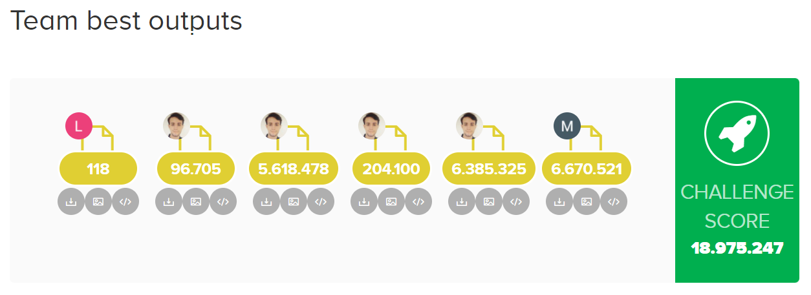

# Reply Code Challenge 2022

Team Boneless

## Abstract

Abstract
In the fantasy world of Replyland, legend says that in ancient times the
Gods hid a jar in a cave, on the peak of the highest mountain. No one
knew what was in the jar. Some said it contained eternal fortune, others
terrible disgrace. Only one man dared to climb the mountain and take the
jar: Epimetheus. He was power-hungry and imagined the jar would give him
the ability to defeat anyone.
Once back in his village, he gathered everyone in the square and opened
the jar. From it a shadow emerged and exploded into thousands of pieces
that were scattered across Replyland. The sky thundered and a godly voice
bellowed: “You dared to open the jar and free all the evils and sins ever
known. Only a true hero can gather all the demons and put them back into
the jar”. Pandora, Epimetheus’ wife, emerged from the crowd and said: “My
husband was that foolish to challenge the Gods and open the sacred jar. I
will challenge the demons to restore the balance.” Everyone knew and respected
Pandora: she was a devotee to the magic of light and nature, and a
very powerful healer. The godly voice thus declared: “So be it. Your journey
starts now.”
Your task is to help Pandora face the perils of her mission. Choose the
enemies she confronts carefully, and collect as many of the Shadow’s fragments
as possible...

## Score

